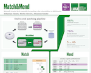

# Match&Mend: Minimally Invasive Local Reassembly for Patching N-day Vulnerabilities in ARM Binaries
**Authors**: Sebastian Jänich, Merlin Sievers, Johannes Kinder

This is the artifact accompanying the paper
_Match&Mend: Minimally Invasive Local Reassembly for Patching N-day Vulnerabilities in ARM Binaries_
appearing in the 11th IEEE European Symposium on Security and Privacy (EuroS&P) [\[PDF\]](https://www.plai.ifi.lmu.de/publications/eurosp26-matchnmend.pdf), July 6 -10, in Lisbon, Portugal, 2026

**Poster**: 

[](./poster/eurosp26.pdf)

# 🧩 Match & Mend

**Match & Mend** is a binary patching tool for fixing known vulnerabilities in ELF binaries.

---

## 📂 Project Structure

- `patching/function.py` — Core patching logic of Match & Mend  

---

## ⚙️ How to Use

### 🧪 First Evaluation (Magma)


Requires manual building of the targets.
Automation of this process is currently work in progress.


### 🧪 Second Evaluation (Karonte)

requires `ninja` to be installed in order to build `lief`.
You also need uv: https://docs.astral.sh/uv/

To run, execute:

```
uv run ./evaluate-karonte.py
```
